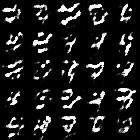

# Machine Vision

This library implements several Anomaly detection methods using Tensorflow 2.X. It can also be used for other purposes, such as GANs, classifiers or object detectors..

## Installation

This repo is based on a creating docker images. Steps for installation:

1. Install [Docker](https://docs.docker.com/get-docker/).
1. (Recommended) Install [Nvidia Container Toolkit](https://github.com/NVIDIA/nvidia-docker) for GPU capabilities in Docker.
  - If these are not used you can run code using CPU resources. To do this add `-p cpu` to execution command.
1. Build docker image with `make image`
1. Run code with interactive command line or as a bash script.
  - __Command line__ - Use command `make image` to launch interactive docker container. Alternatively, use `make headless` to launch without display capabilities (Cannot use GUI based tools like `plt.show()`).
  - __Bash script__ - Run `bash scripts/alias` to register docker alias for running bash scripts. You can then run bash scripts with `vision bash experiment_bash_script.bash`

## Implementations and Results
Please reference wiki page (TBD) for detailed method descriptions and results.

### Classifiers
- Classifier: `python Training.py -f Classifier.json`

### Generators
These methods take a training set of images, and learn how to generate them.
- Auto Encoder (AE): `python Training.py -f AE.json`
- Variational Auto Encoder (VAE): `python Training.py -f VAE.json`
- Generative Adversarial Network (GAN): `python Training.py -f GAN.json`
- Wasserstein Generative Adversarial Network (WGAN): `python Training.py -f WGAN.json`
- Bi-Directional Generative Adversarial Network (BiGAN): `python Training.py -f BiGAN.json`

### Anomaly Detection
These methods take a training set of images, learn how to generate them, and then can be used to identify images not from the training set..
- AE: `python Training.py -f AE_AD.json`
- VAE: `python Training.py -f VAE_AD.json`
- AnoGAN: `python Training.py -f Anogan.json`
- fAnoGAN: `python Training.py -f fAnoGAN.json`
- GANomaly: `python Training.py -f Ganomaly.json`

## Example Results
Example generation of digits:\

\
*__Generator Results__ - (Left-GAN, Right-WGAN)*

Example Anomaly detection results:\
\
*__Autoencoder Anomaly Detection Results__ - Queried Images(left) are passed through the Autoencoder and regenerated(center). If the image is not within the original dataset, then the Autoencoder struggles to recreate the image. In this experiment the Autoencoder was trained without data from the four class in MNIST Digits. This results in poor reconstruction of fours, often as nines, and high mean-squared-error between the original and generated images(right). This can be used as a predictor for anomaly detection.*

\
*__Autoencoder Latent Representation__ - (Left) Latent representation when training data from all digits is used. The Autoencoder clusters digits into distinct clusters. (Right) Latent Representation when Autoencoder is trained without data from the four class. Fours become clusted in the nine cluster due to their similar appearance. This results in fours being reconstructed as nines, as seen in previous figure.*

## Performance Notes:
Tensorflow implementation(__average 21.2s/epoch__) of an autoencoder is 10% faster than Pytorch implementation(__average 23.4s/epoch__).
Experiment used same batch size, epochs, optimizer, learning rate on the MNIST dataset.
Convolutional networks were used for both cases, but are slightly different because padding is handled differently in Conv2D Transpose (Similar number of variables).
Testing was performed on GTX1050. (Optimal  may vary by GPU )

Pytorch script is `torch-test/AutoencoderTorch.py`. Docker image for pytorch is included in `docker/` folder.
Tensorflow script is `python Training.py -f AE_v3.json`

## Code Notes 
### Network Generation
This code base uses a modularly defined json files to define different network architectures.
